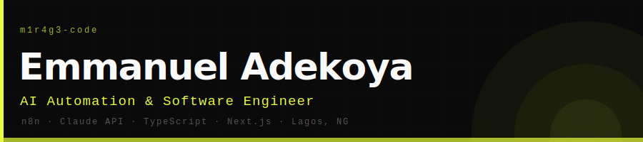

<div align="center">



<br/>


</div>

<br/>

```
I don't just build AI systems for clients.
I run my entire operation on systems I built myself.
```

<br/>

## What I Build

**AI Automation** — n8n orchestration, Claude/OpenAI agents, multi-step pipelines, CRM automation, webhook-driven workflows

**Full-Stack Software** — Next.js 14, React 19, TypeScript, Supabase, Firebase, Django, FastAPI — shipped and deployed, not just prototyped

**AI Operating Systems** — hephzibah-os runs my outreach. upwork-os runs my freelancing. I build frameworks, not just features.

<br/>

## Active Builds

<div align="center">

| Project | What it is | Live |
|---|---|---|
| [hephzibah-os](https://github.com/m1r4g3-code/hephzibah-os) | AI cold outreach intelligence — lead research, call coaching, script generation | Active |
| [upwork-os](https://github.com/m1r4g3-code/upwork-os) | Claude Code-powered Upwork operating system | Active |
| [noryx-studio](https://github.com/m1r4g3-code/noryx-studio) | Full-stack barbershop booking + admin dashboard | Live |
| [Distill](https://github.com/m1r4g3-code/Distill) | URL to clean structured JSON for AI pipelines and RAG | Live API |
| [yct-exam-nav-system](https://github.com/m1r4g3-code/yct-exam-nav-system) | Exam timetable generator — DSatur graph coloring + Dijkstra | Deployed |

</div>

<br/>

## Stack

<div align="left">


</div>

<br/>

## GitHub Stats

<div align="center">


</div>

<div align="center">


</div>

<br/>

## Connect

<div align="center">

[](https://www.linkedin.com/in/hephzibah-ifeoluwa-2ab82b2b7)
[](https://v0-portfolio-website-plan-indol.vercel.app)
[](https://www.upwork.com/freelancers/~011b48d2eabbfa6361)

<br/>


</div>
